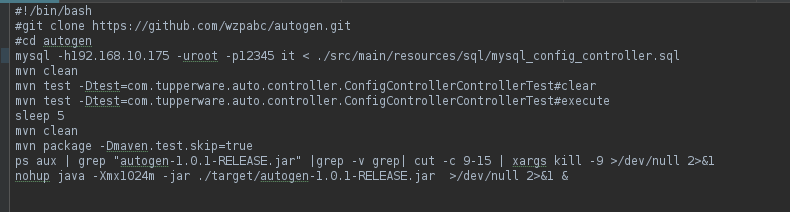
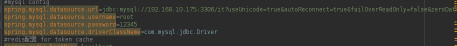
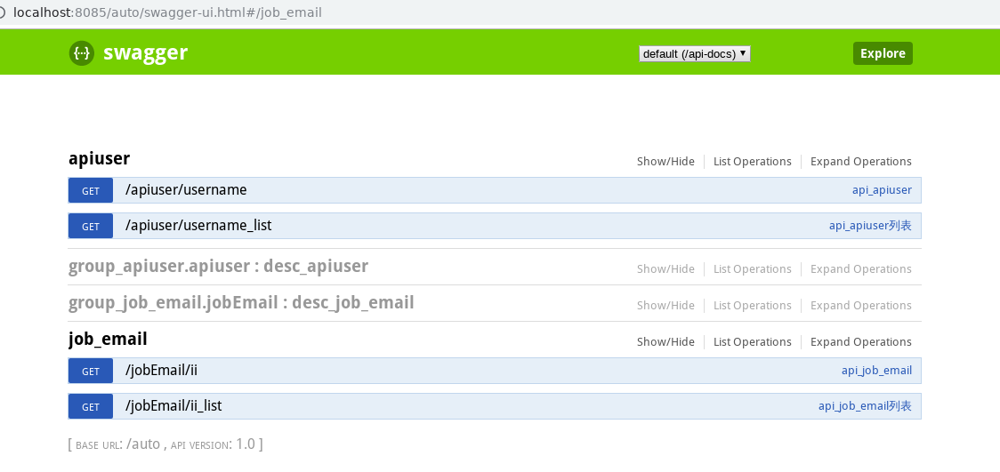

# autogen
pasering sql by alibaba druid and generate swagger api simply.by default records in table `config_controller` are generation by sql with index cloumns as conditions ,('') as default values
each indexes will generate one relative record in table config_controller,and two api url neither in `Datainfo `format or `List<>` format.
### first, get the source code
`git clone https://github.com/wzpabc/autogen.git`

`cd autogen&&ls`

`chmod 755 ./install.sh`

### second,modify the db connections 

modify the db connections from files install.sh and application.properties, piont to you mysql database

* install.sh


* application.properties 



#### then, testing 

pase the sql script below in your database, pick up the one works ,to make sure ./src/main/resources/sql/mysql_config_controller.sql is correct

* for Server version: 5.5.60-MariaDB MariaDB Server or mysql(not community version)
```mysql
SELECT
       concat('group','_',t.name) `group_id`,
       database() table_schema,
       t.name table_name,
       'table' table_type,
       concat('desc','_',t.name) table_desc,
       concat('api','_',t.name) api_value,
       concat('notes','_',t.name) notes,
       concat('\"',t.name,'\"')flag,
       'application/json' producers,
       'true' required,
       0 isdisabled,
       'no' construct,
       0 ignored,
       i.name request_path,
       'GET'request_method,
       i.name function_name,
       concat('select * from ',t.name,' where ',GROUP_CONCAT(concat(f.name,'=\'\'') ORDER BY f.pos  separator ' and ') ) query,
       0 auth,
       CURRENT_TIMESTAMP() update_date
FROM information_schema.innodb_sys_tables t
       JOIN information_schema.innodb_sys_indexes i USING (table_id)
       JOIN information_schema.innodb_sys_fields f USING (index_id)
WHERE t.schema = database() and t.name<>'config_controller'
  and i.name<>'PRIMARY'
GROUP BY t.name,i.name limit 2
;
```
* for Server version: 5.6.39 MySQL Community Server (GPL)
```mysql
SELECT
       concat('group','_', substring_index(t.name,'/',-1) ) `group_id`,
       database() table_schema,
        substring_index(t.name,'/',-1)  table_name,
       'table' table_type,
       concat('desc','_', substring_index(t.name,'/',-1) ) table_desc,
       concat('api','_', substring_index(t.name,'/',-1) ) api_value,
       concat('notes','_', substring_index(t.name,'/',-1) ) notes,
       concat('\"', substring_index(t.name,'/',-1) ,'\"')flag,
       'application/json' producers,
       'true' required,
       0 isdisabled,
       'no' construct,
       0 ignored,
       i.name request_path,
       'GET'request_method,
       i.name function_name,
       concat('select * from ', substring_index(t.name,'/',-1) ,' where ',GROUP_CONCAT(concat(f.name,'=\'\'') ORDER BY f.pos  separator ' and ') ) query,
       0 auth,
       CURRENT_TIMESTAMP() update_date
FROM information_schema.innodb_sys_tables t
	  JOIN information_schema.tables x on x.table_name=substring_index(t.name,'/',-1) and x.table_schema=substring_index(t.name,'/',1)
       JOIN information_schema.innodb_sys_indexes i USING (table_id)
       JOIN information_schema.innodb_sys_fields f USING (index_id)
WHERE x.table_schema = database() and substring_index(t.name,'/',-1) <>'config_controller'
  and i.name<>'PRIMARY'
GROUP BY t.name,i.name limit 2
;
```

### finally, run shell script 

locate to root folder of project then

`./install.sh`

### demo

`http://localhost:8085/auto/swagger-ui.html`



# Please know that

also can modify table config_controller manually to make it more beautifull,

* clear it first.

`mvn test -Dtest=com.tupperware.auto.controller.ConfigControllerControllerTest#clear`

* generate the api again when finish modification

`mvn clean`

`mvn test -Dtest=com.tupperware.auto.controller.ConfigControllerControllerTest#execute`

`sleep 5`

`mvn clean`

`mvn package -Dmaven.test.skip=true`

`ps aux | grep "autogen-1.0.1-RELEASE.jar" |grep -v grep| cut -c 9-15 | xargs kill -9 >/dev/null 2>&1`

`nohup java -Xmx1024m -jar ./target/autogen-1.0.1-RELEASE.jar  >/dev/null 2>&1 &`


[点击前往谷歌搜索](https://www.google.com.hk/)
 