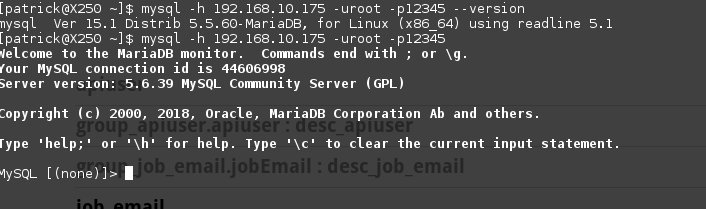

# autogen
### first crete database in mysql 
* create database gen_mysql
#### import sql script into gen_mysql
* step 0 

`generate mysql_config_controller.sql`
* step 1. 

`mysql -uroot -proot gen_mysql < mysql_config_controller.sql
`

* step 2 .

`mvn test -Dtest=com.tupperware.auto.controller.ConfigControllerControllerTest#clear`  

`mvn test -Dtest=com.tupperware.auto.controller.ConfigControllerControllerTest#execute`  


* step 3 .

`mvn test -Dtest=com.tupperware.auto.controller.ConfigControllerControllerTest#testFormatSql`  

* step 4 package .

`mvn package -D maven.test.skip=true`

* step 5 start

`java -jar ./target/autogen-1.0.1-RELEASE.jar `

* classpath:template folder from gen
* classpath:templates folder from UI



```mysql
---Server version: 5.5.60-MariaDB MariaDB Server /mysql

SELECT
       concat('group','_',t.name) `group_id`,
       database() table_schema,
       t.name table_name,
       'table' table_type,
       concat('desc','_',t.name) table_desc,
       concat('api','_',t.name) api_value,
       concat('notes','_',t.name) notes,
       concat('\"',t.name,'\"')flag,
       'application/json' producers,
       'true' required,
       0 isdisabled,
       'no' construct,
       0 ignored,
       i.name request_path,
       'GET'request_method,
       i.name function_name,
       concat('select * from ',t.name,' where ',GROUP_CONCAT(concat(f.name,'=\'\'') ORDER BY f.pos  separator ' and ') ) query,
       0 auth,
       CURRENT_TIMESTAMP() update_date
FROM information_schema.innodb_sys_tables t
       JOIN information_schema.innodb_sys_indexes i USING (table_id)
       JOIN information_schema.innodb_sys_fields f USING (index_id)
WHERE t.schema = database() and t.name<>'config_controller'
  and i.name<>'PRIMARY'
GROUP BY t.name,i.name limit 2
;
```
```mysql
--- Server version: 5.6.39 MySQL Community Server (GPL)
SELECT
       concat('group','_', substring_index(t.name,'/',-1) ) `group_id`,
       database() table_schema,
        substring_index(t.name,'/',-1)  table_name,
       'table' table_type,
       concat('desc','_', substring_index(t.name,'/',-1) ) table_desc,
       concat('api','_', substring_index(t.name,'/',-1) ) api_value,
       concat('notes','_', substring_index(t.name,'/',-1) ) notes,
       concat('\"', substring_index(t.name,'/',-1) ,'\"')flag,
       'application/json' producers,
       'true' required,
       0 isdisabled,
       'no' construct,
       0 ignored,
       i.name request_path,
       'GET'request_method,
       i.name function_name,
       concat('select * from ', substring_index(t.name,'/',-1) ,' where ',GROUP_CONCAT(concat(f.name,'=\'\'') ORDER BY f.pos  separator ' and ') ) query,
       0 auth,
       CURRENT_TIMESTAMP() update_date
FROM information_schema.innodb_sys_tables t
	  JOIN information_schema.tables x on x.table_name=substring_index(t.name,'/',-1) and x.table_schema=substring_index(t.name,'/',1)
       JOIN information_schema.innodb_sys_indexes i USING (table_id)
       JOIN information_schema.innodb_sys_fields f USING (index_id)
WHERE x.table_schema = database() and substring_index(t.name,'/',-1) <>'config_controller'
  and i.name<>'PRIMARY'
GROUP BY t.name,i.name limit 2
;
```
[点击前往谷歌搜索](https://www.google.com.hk/)
 